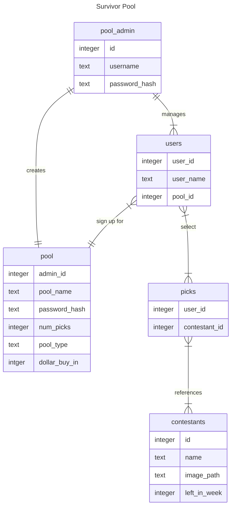

# survivor_pool
flask website

## database

```mermaid
---
title: Survivor Pool
---

erDiagram
   pool_admin{
    integer id
    text username
    text password_hash
   }
   pool_admin ||--|| pool : "creates"
   pool{
    integer admin_id
    text pool_name
    text password_hash
    integer num_picks
    text pool_type
    intger dollar_buy_in
   }
   users }|--|| pool : "sign up for"
   
   pool_admin ||--|{ users : manages
   
   users{
    integer user_id
    text user_name
    integer pool_id
   }

   users }|--|{ picks : "select"
   picks{
    integer user_id
    integer contestant_id
   }
    contestants{
        integer id
        text name
        text image_path
        integer left_in_week
    }
%% contestants }|--|{ picks : ""
picks }|--|{ contestants : "references"  
```
