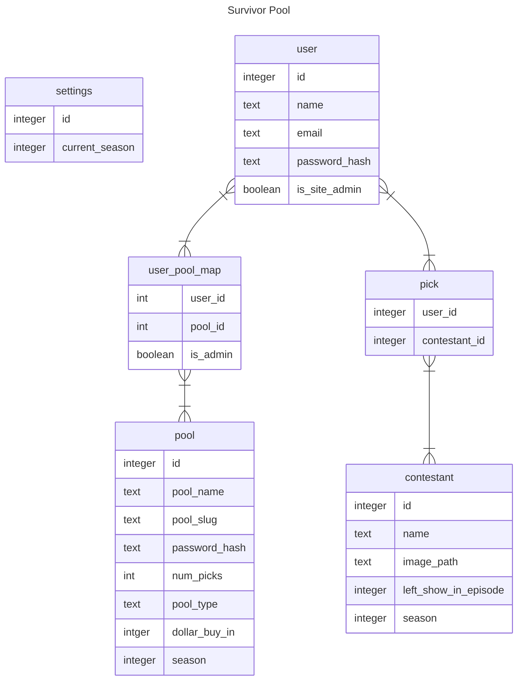

# survivor_pool
Flask website for creating betting pools for popular American reality television show, Survivor.

## Database

```mermaid
---
title: Survivor Pool
---

erDiagram
    settings{
        integer id
        integer current_season
    }
   pool{
    integer id
    text pool_name
    text pool_slug
    text password_hash

    int num_picks
    text pool_type
    intger dollar_buy_in
    integer season
   }
   user }|--|{ user_pool_map : ""
   user_pool_map }|--|{ pool : ""

   user_pool_map {
    int user_id
    int pool_id
    boolean is_admin
   }
   
   user{
    integer id
    text name
    text email
    text password_hash
    boolean is_site_admin
   }

   user }|--|{ pick : ""
   pick{
    integer user_id
    integer contestant_id
   }
    contestant{
        integer id
        text name
        text image_path
        integer left_show_in_episode
        integer season
    }
%% contestants }|--|{ pick : ""
pick }|--|{ contestant : ""  
```

database tables

CREATE TABLE user (
    id INTEGER
)
